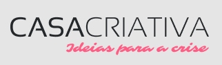
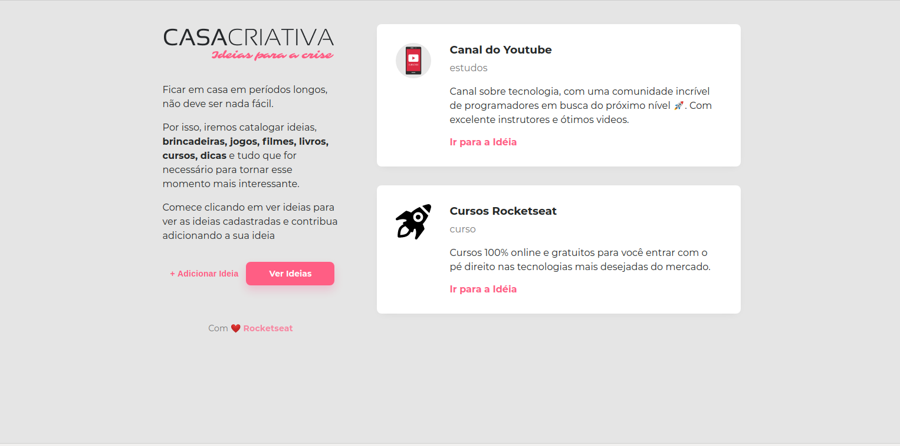
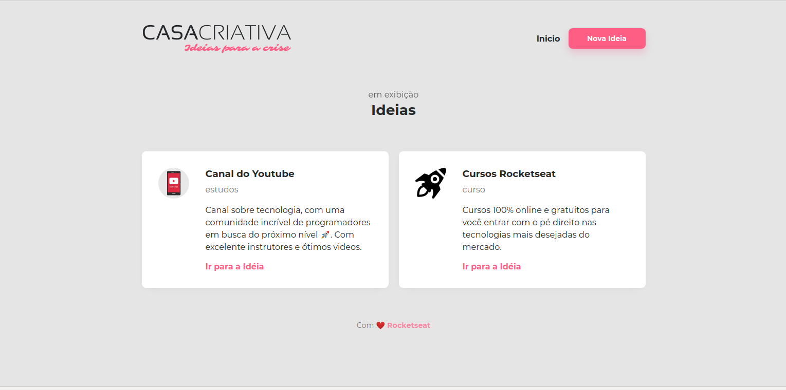
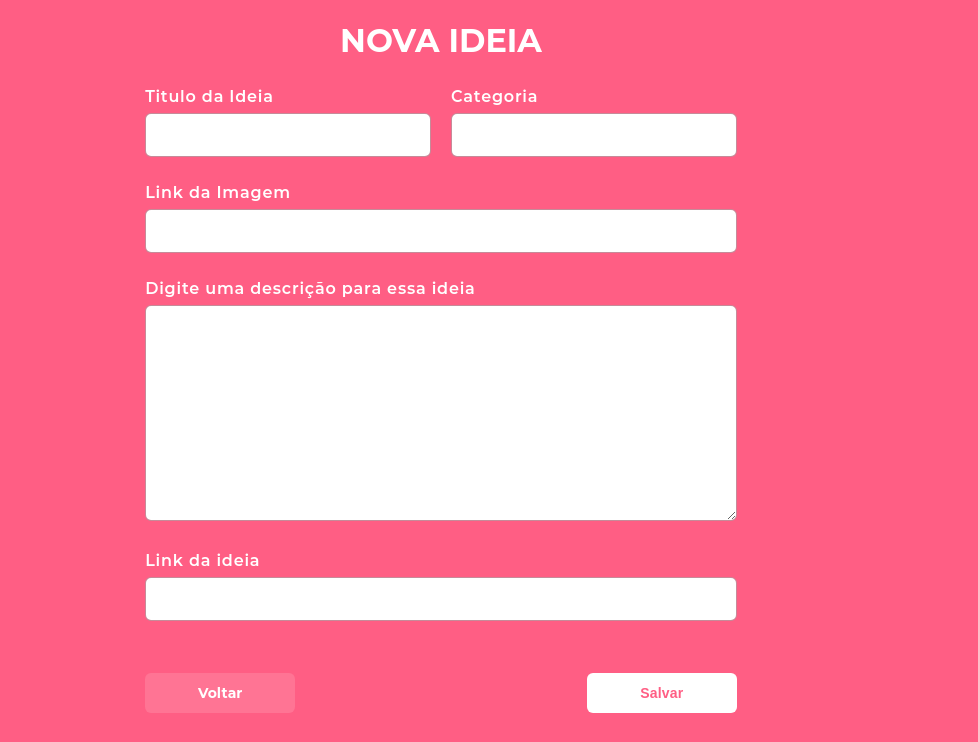

<h1 align="center">
    
</h1>

<h2 align="center">
   
💜 Casa Criativa 🚀

</h2>

  

  

  

  <a href="#projeto">Projeto</a>&nbsp;&nbsp;&nbsp;|&nbsp;&nbsp;&nbsp;
  <a href="#protótipos">Protótipos</a>&nbsp;&nbsp;&nbsp;|&nbsp;&nbsp;&nbsp;
  <a href="#tecnologias">Tecnologias</a>&nbsp;&nbsp;&nbsp;
  

## Projeto:

O projeto foi desenvolvido durante o Workshop Dev Especial ministrada pela Rockseat. Consiste em uma aplicação na qual 
o usuário catalogar ideias, brincadeiras, jogos, filmes, livros, cursos, dicas e tudo que for necessário para tornar 
e de seu interessante.

## Protótipos:

> Web:

    
    
    

## Tecnologias
- HTML
- CSS
- JAVASCRiPTY
